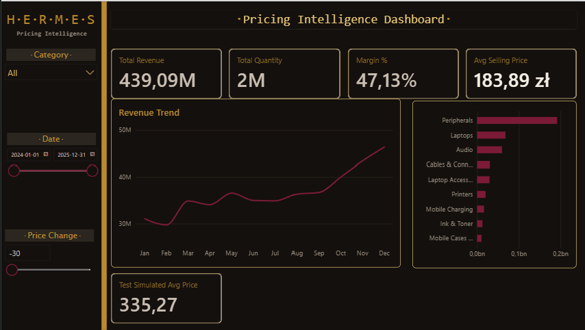
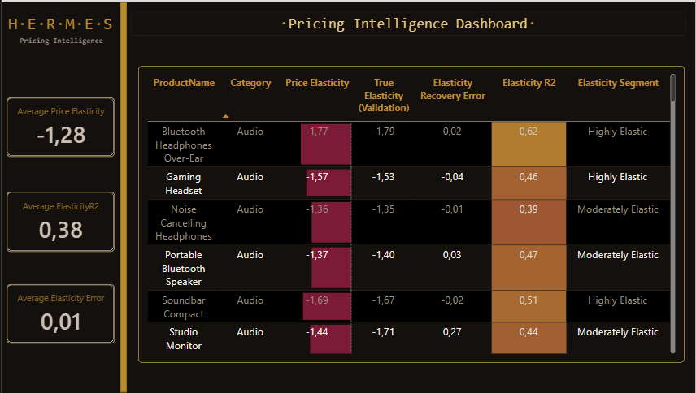
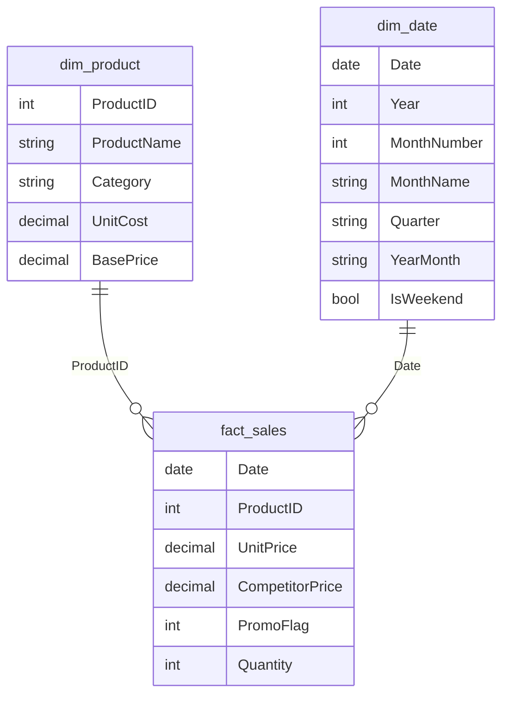

# H.E.R.M.E.S.
### Heuristic Elasticity & Revenue Modeling Engine System

Projekt Power BI, który odpowiada na jedno pytanie, którego większość firm boi się zadać wprost:

> **"Co się stanie z naszym przychodem i marżą, jeśli zmienimy cenę — i skąd w ogóle wiemy, że to bezpieczne?"**

HERMES modeluje **elastyczność cenową popytu** (jak bardzo klienci reagują na zmianę ceny) na podstawie danych sprzedażowych, a następnie pozwala symulować scenariusze cenowe w czasie rzeczywistym — bez arkusza kalkulacyjnego, bez proszenia działu IT o nowy raport, bez zgadywania.

---

## Zrzuty ekranu

**Dashboard główny** — KPI, trend przychodu, przychód wg kategorii, symulacja What-If:



**Strona QA / walidacji modelu** — porównanie elastyczności policzonej przez model z wartością referencyjną:



---

## O co tu w ogóle chodzi (kontekst biznesowy)

Elastyczność cenowa popytu (PED) to jedna liczba, która mówi, o ile procent zmieni się sprzedaż, gdy cena zmieni się o 1%. To rozstrzyga jedno z najdroższych pytań w firmie:

- **Popyt nieelastyczny** (klient mało wrażliwy na cenę, np. tusz do drukarki — musisz go kupić, skoro masz drukarkę) → podwyżka ceny **zwiększa** przychód i marżę.
- **Popyt elastyczny** (klient łatwo ucieka do zamiennika, np. kabel USB-C) → podwyżka ceny **zmniejsza** przychód.

Firmy, które ustalają ceny "po równo" dla całego katalogu, zostawiają pieniądze na stole albo tracą sprzedaż tam, gdzie tego nie widać na pierwszy rzut oka. HERMES liczy to per produkt, zamiast zgadywać.

---

## Co robi ten projekt — najważniejsze elementy

- **Regresja log-log liczona natywnie w DAX** (`LINESTX`) — elastyczność cenowa wyliczana bezpośrednio w silniku Power BI, bez eksportu danych do Pythona czy R.
- **Regresja wieloraka, nie prosta** — model kontroluje jednocześnie własną cenę i cenę konkurencji, żeby uniknąć błędu pominiętej zmiennej (przypisania naszej cenie efektu, który w rzeczywistości wywołała konkurencja).
- **Syntetyczne dane z wbudowaną "odpowiedzią prawdziwą"** — generator danych (PowerShell) celowo zaszywa znaną elastyczność dla każdego z 64 produktów, żeby model dało się realnie zwalidować, a nie tylko "zaufać, że działa". Osobna strona QA w raporcie zestawia wynik regresji z tą wartością referencyjną.
- **Symulacja cenowa w czasie rzeczywistym (What-If)** — suwak zmiany ceny (parametr Power BI, tabela odłączona) połączony z policzoną elastycznością, przeliczający symulowany wolumen, przychód i marżę na żywo.
- **Miara "Ryzyko" dla nietechnicznych odbiorców** — warstwa tłumacząca wynik regresji na jedno zdanie w prostym języku ("bezpieczne / neutralne / ryzykowne"), uwzględniająca też pewność samego oszacowania (R²), nie tylko kierunek zmiany.
- **Paleta kolorów zwalidowana matematycznie pod kątem dostępności** — dobór kolorów przetestowany symulacją daltonizmu (protanopia/deuteranopia) w przestrzeni OKLab, nie dobrany "na oko".
- **Model gwiazdy + Composite Model (w budowie)** — klasyczna architektura fakt/wymiary jako fundament pod docelową warstwę Import + DirectQuery.

---

## Architektura danych



Dodatkowo: tabela `_Measures` (kontener na wszystkie miary DAX), odłączony parametr What-If `Price Change %`, oraz ukryta tabela `_ValidationKey` (referencyjna elastyczność do walidacji modelu, bez relacji z resztą modelu — celowo, żeby niczego nie filtrowała).

---

## Stack technologiczny

| Warstwa | Technologia |
|---|---|
| Wizualizacja / model | Power BI Desktop |
| ETL | Power Query (M) |
| Logika analityczna | DAX (`LINESTX`, regresja wieloraka, `SELECTEDVALUE`, `LOOKUPVALUE`) |
| Generowanie danych testowych | PowerShell |
| Motyw wizualny | Własny theme JSON, zwalidowany pod kątem dostępności (OKLab + symulacja CVD) |

---

## Struktura repozytorium

```
hermes/
├── HERMES.pbix                      # główny plik Power BI
├── data/
│   ├── fact_sales.csv               # 46 784 wiersze, 64 SKU, 2024-01-01 – 2025-12-31
│   ├── dim_product.csv              # 64 produkty w 9 kategoriach
│   └── _answer_key_elasticity.csv   # referencyjna elastyczność (walidacja modelu)
├── scripts/
│   └── generate_data.ps1            # generator syntetycznych danych sprzedażowych
├── theme/
│   └── HERMES_theme.json            # motyw wizualny Power BI
└── media/
    ├── main_dashboard.png
    └── qa_dashboard.png
```

---

## Dane: 64 produkty, 9 kategorii, jeden celowy kontrast

Katalog produktów obejmuje m.in. Drukarki, Tusze i Tonery, Laptopy, Peryferia, Kable, Audio i Akcesoria Mobilne. Dwie kategorie — **Printers** i **Ink & Toner** — są zaprojektowane jako świadomy, kompletny kontrast modelu cenowego **"razor and blades"** (maszynka i żyletki): drukarki sprzedawane przy cienkiej marży i wysokiej elastyczności cenowej, tusze — przy grubej marży i niskiej elastyczności (efekt "lock-in": kto kupił drukarkę, musi kupować pasujący tusz). Model poprawnie odzyskuje ten kontrast z samych danych transakcyjnych, nie znając wcześniej intencji generatora.

---

## Status projektu

- [x] Generator syntetycznych danych sprzedażowych (64 SKU, wbudowana referencyjna elastyczność)
- [x] ETL w Power Query (import, typowanie, wymuszona kultura liczbowa)
- [x] Model gwiazdy (fakt + wymiary + tabela kalendarza jako Date Table)
- [x] Podstawowe miary DAX (przychód, marża, ilość, średnia cena ważona wolumenem)
- [x] Motyw wizualny zwalidowany pod kątem dostępności (symulacja daltonizmu)
- [x] Parametr What-If (symulowana zmiana ceny)
- [x] Regresja elastyczności cenowej (`LINESTX`, regresja wieloraka) + strona walidacji modelu
- [x] Symulacja cenowa (wpływ na wolumen / przychód / marżę) + miara "Ryzyko" w prostym języku
- [ ] Warstwa Composite Model (Import + DirectQuery)
- [ ] Finalny, w pełni rozbudowany dashboard + storytelling portfolio

---

## Jak to odtworzyć

1. Wygeneruj dane: uruchom `scripts/generate_data.ps1` w PowerShell — utworzy pliki CSV w `data/`.
2. Otwórz `HERMES.pbix` w Power BI Desktop i odśwież dane (**Narzędzia główne → Odśwież**).
3. (Opcjonalnie) zaimportuj motyw wizualny: **Widok → Motywy → Przeglądaj w poszukiwaniu motywów** → wskaż `theme/HERMES_theme.json`.
